# FleetGuard API Documentation

## Overview

FleetGuard is a RESTful ASP.NET Core Web API designed to simulate an enterprise device-management and diagnostic platform.

The API allows clients to:

- Register enterprise devices
- Retrieve device inventory
- Retrieve individual device details
- Update device information
- Delete devices
- Process device health check-ins
- Automatically evaluate device health
- Store and retrieve diagnostic history
- Enforce validation and serial-number uniqueness

FleetGuard is built using:

- ASP.NET Core 10
- C#
- Entity Framework Core
- SQLite
- LINQ
- Dependency Injection
- Entity Framework Core migrations

The production API is hosted on Microsoft Azure App Service and is automatically deployed through GitHub Actions.

---

# Base URLs

## Production API

```text
https://fleetguard-api-sarthak-ckbchjgyh9f8exdr.canadacentral-01.azurewebsites.net
```

## Local Development

```text
http://localhost:5172
```

All endpoint examples in this document use relative URLs such as:

```http
GET /api/devices
```

For production, the complete URL would be:

```text
https://fleetguard-api-sarthak-ckbchjgyh9f8exdr.canadacentral-01.azurewebsites.net/api/devices
```

---

# API Health Check

The health endpoint confirms that the deployed FleetGuard API is running.

## URL

```http
GET /health
```

## Success Response

```text
200 OK
```

```json
{
  "status": "healthy",
  "application": "FleetGuard API",
  "timestamp": "2026-07-12T06:15:30.0000000Z"
}
```

## Purpose

This endpoint can be used for:

- Deployment verification
- Uptime checks
- Monitoring
- CI/CD validation
- Azure App Service health testing

---

# Device Model

A FleetGuard device represents a managed enterprise endpoint.

```json
{
  "id": "4ccc9e3c-2418-4dd8-a757-dfa38cb87096",
  "deviceName": "Warehouse Scanner 101",
  "serialNumber": "WH-1001",
  "platform": 1,
  "status": 2,
  "operatingSystemVersion": "Android 15",
  "batteryLevel": 98,
  "isEncrypted": true,
  "isScreenLockEnabled": true,
  "isRootedOrJailbroken": false,
  "ipAddress": "192.168.1.25",
  "lastCheckInAt": "2026-07-11T21:20:17Z",
  "healthMessage": "Healthy: Device passed all current checks."
}
```

---

# Device Properties

| Property | Type | Description |
|---|---|---|
| `id` | GUID | Unique identifier generated by the API |
| `deviceName` | string | Human-readable device name |
| `serialNumber` | string | Unique device serial number |
| `platform` | integer | Device platform enum value |
| `status` | integer | Current health-status enum value |
| `operatingSystemVersion` | string | Installed operating system version |
| `batteryLevel` | integer or null | Most recently reported battery percentage |
| `isEncrypted` | boolean or null | Whether device storage is encrypted |
| `isScreenLockEnabled` | boolean or null | Whether screen lock is enabled |
| `isRootedOrJailbroken` | boolean or null | Whether device compromise was detected |
| `ipAddress` | string or null | Most recently reported IP address |
| `lastCheckInAt` | UTC timestamp or null | Time of the most recent check-in |
| `healthMessage` | string | Explanation of the current health state |

A newly registered device has not completed a check-in, so several health properties may initially be `null`.

---

# Device Platform Values

| Value | Platform |
|---:|---|
| `1` | Android |
| `2` | iOS |
| `3` | Windows |
| `4` | Linux |
| `5` | Printer |
| `6` | Other |

The frontend displays the corresponding platform name while the API stores the strongly typed enum value.

---

# Device Status Values

| Value | Status | Meaning |
|---:|---|---|
| `1` | Pending | Device has not completed a health check-in |
| `2` | Healthy | Device passed all current health checks |
| `3` | Warning | A non-critical compliance problem was detected |
| `4` | Critical | A serious security or compliance problem was detected |

---

# Endpoint 1 — Register Device

Registers a new enterprise device.

## URL

```http
POST /api/devices
```

## Request Headers

```http
Content-Type: application/json
```

## Request Body

```json
{
  "deviceName": "Warehouse Scanner 101",
  "serialNumber": "WH-1001",
  "platform": 1,
  "operatingSystemVersion": "Android 15"
}
```

## Processing

The API:

1. Validates the incoming request
2. Trims user-provided string values
3. Normalizes the serial number
4. Checks for an existing serial number
5. Creates a new `Device` entity
6. Saves it through Entity Framework Core
7. Returns the newly created device

Serial numbers are normalized so values such as these are treated as duplicates:

```text
WH-1001
wh-1001
Wh-1001
 WH-1001
```

## Success Response

```text
201 Created
```

```json
{
  "id": "4ccc9e3c-2418-4dd8-a757-dfa38cb87096",
  "deviceName": "Warehouse Scanner 101",
  "serialNumber": "WH-1001",
  "platform": 1,
  "status": 1,
  "operatingSystemVersion": "Android 15",
  "batteryLevel": null,
  "isEncrypted": null,
  "isScreenLockEnabled": null,
  "isRootedOrJailbroken": null,
  "ipAddress": null,
  "lastCheckInAt": null,
  "healthMessage": "Device has not checked in yet."
}
```

## Validation Failure

```text
400 Bad Request
```

This may occur when required fields are missing.

Example:

```json
{
  "type": "https://tools.ietf.org/html/rfc9110#section-15.5.1",
  "title": "One or more validation errors occurred.",
  "status": 400,
  "errors": {
    "SerialNumber": [
      "The SerialNumber field is required."
    ]
  }
}
```

## Duplicate Serial Number

```text
409 Conflict
```

```json
{
  "message": "A device with this serial number already exists."
}
```

## Postman Example

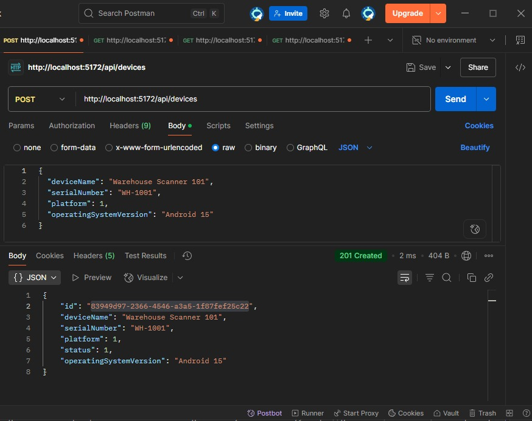

---

# Endpoint 2 — Retrieve All Devices

Returns all registered devices.

## URL

```http
GET /api/devices
```

## Success Response

```text
200 OK
```

```json
[
  {
    "id": "4ccc9e3c-2418-4dd8-a757-dfa38cb87096",
    "deviceName": "Warehouse Scanner 101",
    "serialNumber": "WH-1001",
    "platform": 1,
    "status": 2,
    "operatingSystemVersion": "Android 15",
    "batteryLevel": 98,
    "isEncrypted": true,
    "isScreenLockEnabled": true,
    "isRootedOrJailbroken": false,
    "ipAddress": "192.168.1.25",
    "lastCheckInAt": "2026-07-11T21:20:17Z",
    "healthMessage": "Healthy: Device passed all current checks."
  }
]
```

If no devices exist, the API returns:

```json
[]
```

An empty array is still a successful response.

---

# Endpoint 3 — Retrieve Device by ID

Returns one device using its GUID.

## URL

```http
GET /api/devices/{id}
```

## Example

```http
GET /api/devices/4ccc9e3c-2418-4dd8-a757-dfa38cb87096
```

## Success Response

```text
200 OK
```

```json
{
  "id": "4ccc9e3c-2418-4dd8-a757-dfa38cb87096",
  "deviceName": "Warehouse Scanner 101",
  "serialNumber": "WH-1001",
  "platform": 1,
  "status": 2,
  "operatingSystemVersion": "Android 15",
  "batteryLevel": 98,
  "isEncrypted": true,
  "isScreenLockEnabled": true,
  "isRootedOrJailbroken": false,
  "ipAddress": "192.168.1.25",
  "lastCheckInAt": "2026-07-11T21:20:17Z",
  "healthMessage": "Healthy: Device passed all current checks."
}
```

## Device Not Found

```text
404 Not Found
```

```json
{
  "message": "Device not found."
}
```

## Invalid Device Example

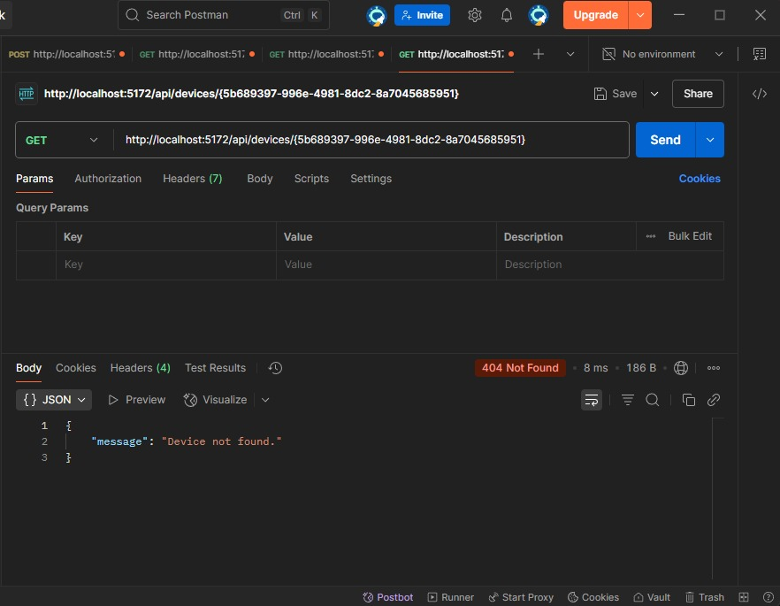

---

# Endpoint 4 — Update Device

Updates an existing device.

## URL

```http
PUT /api/devices/{id}
```

## Request Headers

```http
Content-Type: application/json
```

## Request Body

```json
{
  "deviceName": "Updated Warehouse Scanner",
  "serialNumber": "WH-1001",
  "platform": 1,
  "operatingSystemVersion": "Android 16",
  "status": 2
}
```

## Processing

The API:

1. Searches for the device by ID
2. Returns `404` if the device does not exist
3. Normalizes the serial number
4. Checks whether another device already uses that serial number
5. Updates the entity
6. Saves the changes through Entity Framework Core
7. Returns the updated device

## Success Response

```text
200 OK
```

```json
{
  "id": "4ccc9e3c-2418-4dd8-a757-dfa38cb87096",
  "deviceName": "Updated Warehouse Scanner",
  "serialNumber": "WH-1001",
  "platform": 1,
  "status": 2,
  "operatingSystemVersion": "Android 16",
  "batteryLevel": 98,
  "isEncrypted": true,
  "isScreenLockEnabled": true,
  "isRootedOrJailbroken": false,
  "ipAddress": "192.168.1.25",
  "lastCheckInAt": "2026-07-11T21:20:17Z",
  "healthMessage": "Healthy: Device passed all current checks."
}
```

## Device Not Found

```text
404 Not Found
```

```json
{
  "message": "Device not found."
}
```

## Duplicate Serial Number

```text
409 Conflict
```

```json
{
  "message": "Another device already uses this serial number."
}
```

## Postman Example

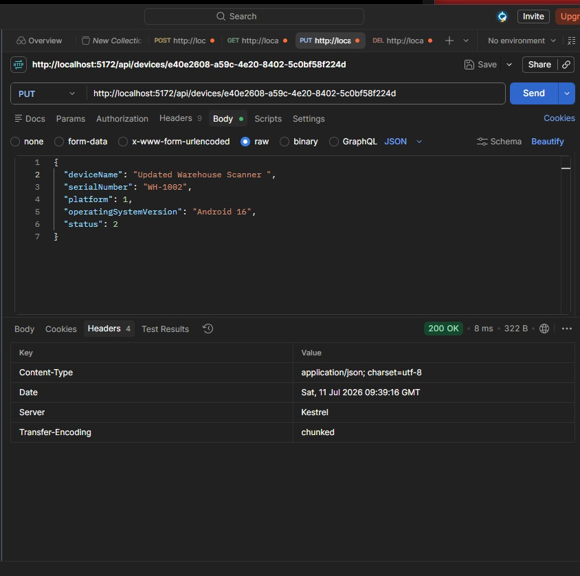

---

# Endpoint 5 — Delete Device

Deletes an existing device.

## URL

```http
DELETE /api/devices/{id}
```

## Example

```http
DELETE /api/devices/4ccc9e3c-2418-4dd8-a757-dfa38cb87096
```

## Success Response

```text
204 No Content
```

The response body is empty when deletion succeeds.

## Device Not Found

```text
404 Not Found
```

```json
{
  "message": "Device not found."
}
```

---

# Endpoint 6 — Device Health Check-In

Allows a managed device to report its latest health, security, and networking information.

## URL

```http
POST /api/devices/{id}/check-in
```

## Request Headers

```http
Content-Type: application/json
```

## Request Body

```json
{
  "batteryLevel": 85,
  "isEncrypted": true,
  "isScreenLockEnabled": true,
  "isRootedOrJailbroken": false,
  "ipAddress": "192.168.1.25"
}
```

## Processing

The API:

1. Finds the requested device
2. Updates the latest device information
3. Sets the check-in time using UTC
4. Evaluates device health using ordered rules
5. Updates the device status
6. Creates a diagnostic-history record
7. Saves both changes
8. Returns the updated device

---

# Health Evaluation Rules

Rules are checked in priority order.

| Priority | Condition | Status | Health Message |
|---:|---|---|---|
| 1 | Rooted or jailbroken | Critical | Critical: Device is rooted or jailbroken. |
| 2 | Storage not encrypted | Critical | Critical: Device storage is not encrypted. |
| 3 | Screen lock disabled | Warning | Warning: Screen lock is not enabled. |
| 4 | Battery below 20% | Warning | Warning: Battery level is below 20%. |
| 5 | All checks pass | Healthy | Healthy: Device passed all current checks. |

The first matching rule determines the result.

For example, if a device is both rooted and has a low battery, the final result is `Critical` because root detection has a higher priority.

---

# Healthy Check-In

## Request

```json
{
  "batteryLevel": 85,
  "isEncrypted": true,
  "isScreenLockEnabled": true,
  "isRootedOrJailbroken": false,
  "ipAddress": "192.168.1.25"
}
```

## Result

```text
200 OK
```

```json
{
  "status": 2,
  "batteryLevel": 85,
  "healthMessage": "Healthy: Device passed all current checks."
}
```

## Example

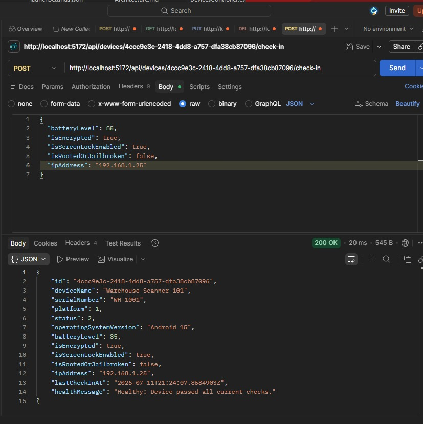

---

# Low-Battery Warning

## Request

```json
{
  "batteryLevel": 18,
  "isEncrypted": true,
  "isScreenLockEnabled": true,
  "isRootedOrJailbroken": false,
  "ipAddress": "192.168.1.25"
}
```

## Result

```json
{
  "status": 3,
  "healthMessage": "Warning: Battery level is below 20%."
}
```

## Example


---

# Screen-Lock Warning

## Request

```json
{
  "batteryLevel": 80,
  "isEncrypted": true,
  "isScreenLockEnabled": false,
  "isRootedOrJailbroken": false,
  "ipAddress": "192.168.1.25"
}
```

## Result

```json
{
  "status": 3,
  "healthMessage": "Warning: Screen lock is not enabled."
}
```

## Example

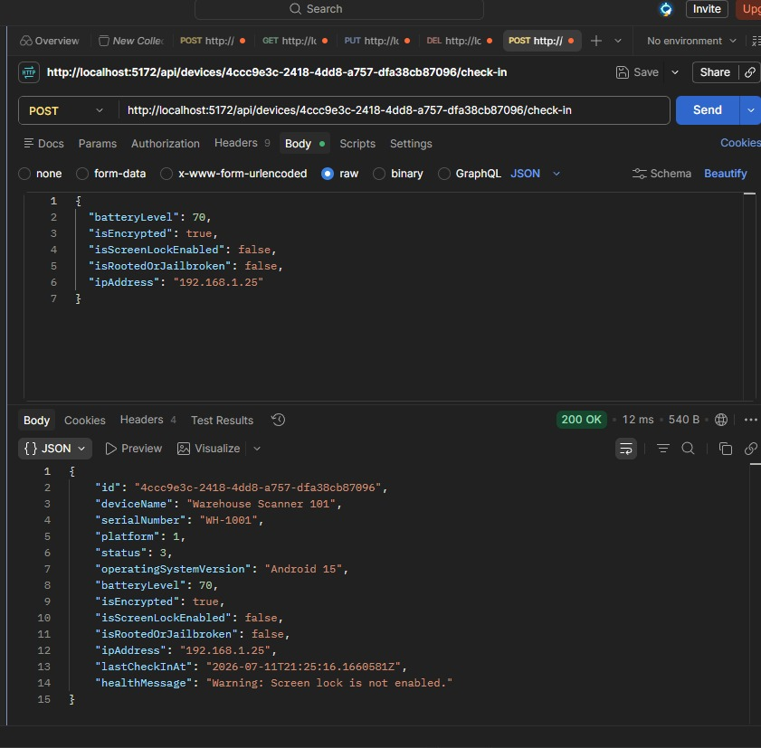

---

# Unencrypted Device

## Request

```json
{
  "batteryLevel": 80,
  "isEncrypted": false,
  "isScreenLockEnabled": true,
  "isRootedOrJailbroken": false,
  "ipAddress": "192.168.1.25"
}
```

## Result

```json
{
  "status": 4,
  "healthMessage": "Critical: Device storage is not encrypted."
}
```

---

# Rooted or Jailbroken Device

## Request

```json
{
  "batteryLevel": 80,
  "isEncrypted": true,
  "isScreenLockEnabled": true,
  "isRootedOrJailbroken": true,
  "ipAddress": "192.168.1.25"
}
```

## Result

```json
{
  "status": 4,
  "healthMessage": "Critical: Device is rooted or jailbroken."
}
```

## Example

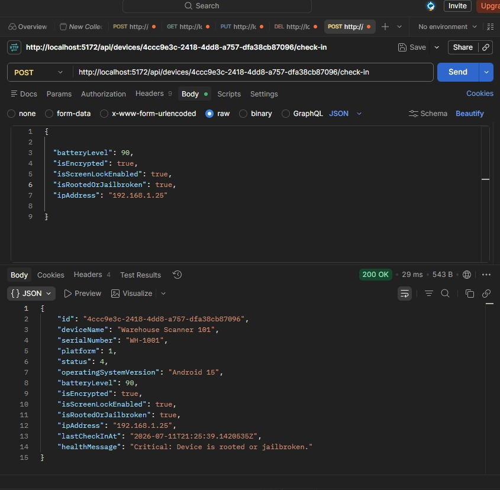

---

# Check-In Validation

The frontend validates battery values between `0` and `100`.

The API request model also validates required input according to the configured data annotations and ASP.NET Core model validation.

## Missing Values Example

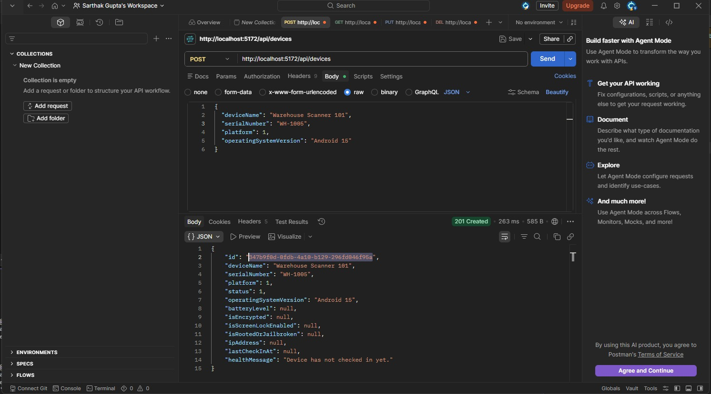

## Battery Validation Example

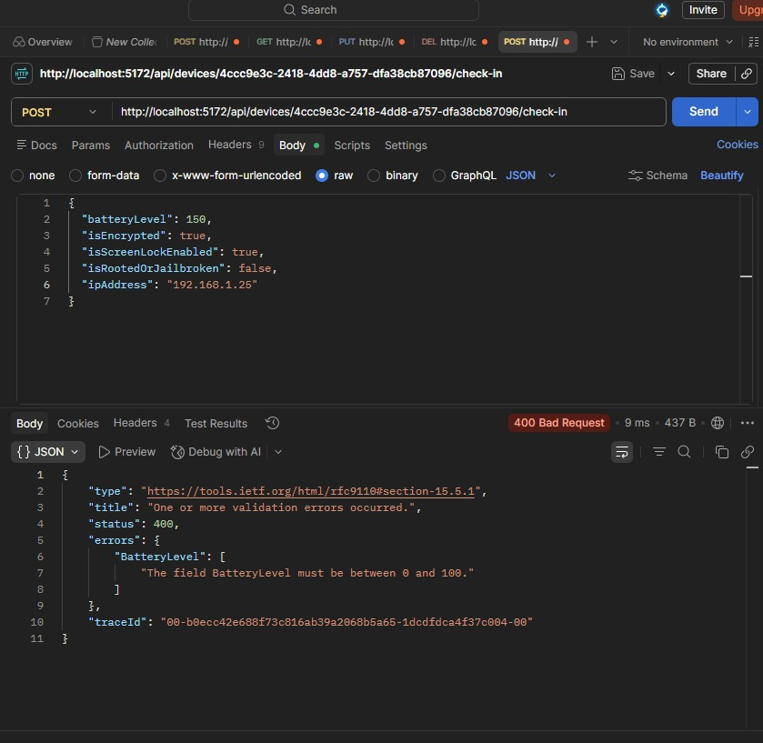

---

# Printer Check-Ins

Printers may not always report battery information.

The FleetGuard dashboard hides the battery field for devices using the Printer platform and displays:

```text
Not monitored
```

The current API request model still includes a battery-level property. A future improvement would make battery level nullable and evaluate it only when the selected device type supports battery monitoring.

---

# Endpoint 7 — Retrieve Diagnostic History

Returns historical device check-ins ordered from newest to oldest.

## URL

```http
GET /api/devices/{id}/diagnostics
```

## Example

```http
GET /api/devices/4ccc9e3c-2418-4dd8-a757-dfa38cb87096/diagnostics
```

## Success Response

```text
200 OK
```

```json
[
  {
    "id": "3fa85f64-5717-4562-b3fc-2c963f66afa6",
    "deviceId": "4ccc9e3c-2418-4dd8-a757-dfa38cb87096",
    "batteryLevel": 18,
    "status": 3,
    "healthMessage": "Warning: Battery level is below 20%.",
    "checkedInAt": "2026-07-12T02:35:00Z"
  },
  {
    "id": "7bd31a84-3f6c-4694-9c70-f4cc88ce1124",
    "deviceId": "4ccc9e3c-2418-4dd8-a757-dfa38cb87096",
    "batteryLevel": 85,
    "status": 2,
    "healthMessage": "Healthy: Device passed all current checks.",
    "checkedInAt": "2026-07-12T02:30:00Z"
  }
]
```

## Device Not Found

```text
404 Not Found
```

```json
{
  "message": "Device not found."
}
```

## Diagnostic History Purpose

Diagnostic records support:

- Historical troubleshooting
- Device health comparison
- Compliance analysis
- Reproduction of changing device conditions
- Root-cause investigation
- Operational monitoring

---

# Diagnostic Log Model

```json
{
  "id": "3fa85f64-5717-4562-b3fc-2c963f66afa6",
  "deviceId": "4ccc9e3c-2418-4dd8-a757-dfa38cb87096",
  "batteryLevel": 18,
  "status": 3,
  "healthMessage": "Warning: Battery level is below 20%.",
  "checkedInAt": "2026-07-12T02:35:00Z"
}
```

| Property | Type | Description |
|---|---|---|
| `id` | GUID | Unique diagnostic event identifier |
| `deviceId` | GUID | Device associated with the event |
| `batteryLevel` | integer | Battery level reported during check-in |
| `status` | integer | Evaluated status at the time of check-in |
| `healthMessage` | string | Explanation of the evaluation result |
| `checkedInAt` | UTC timestamp | Time the diagnostic record was created |

---

# Validation Rules

FleetGuard currently enforces the following rules:

- Device name is required
- Serial number is required
- Operating system version is required
- Platform must be supplied
- Device IDs must be valid GUIDs
- A device must exist before retrieval, update, deletion, check-in, or diagnostic-history access
- Serial numbers are case-insensitively unique
- Serial numbers are normalized before storage
- Duplicate serial numbers return `409 Conflict`
- The database contains a unique index on the serial-number column
- The frontend restricts battery values to the range `0–100`
- Required request-model validation is handled automatically by ASP.NET Core

---

# Serial-Number Data Integrity

FleetGuard protects serial-number uniqueness at two levels.

## Application-Level Validation

The controller checks for an existing normalized serial number before creating or updating a device.

## Database-Level Validation

Entity Framework Core configures a unique index for the `SerialNumber` column.

This prevents duplicate data even if multiple requests occur close together or controller validation is bypassed.

---

# HTTP Status Codes

| Status | Meaning | Typical Use |
|---|---|---|
| `200 OK` | Request completed successfully | Retrieval, update, check-in, diagnostics |
| `201 Created` | Resource was created | Device registration |
| `204 No Content` | Request completed with no response body | Device deletion |
| `400 Bad Request` | Validation failed | Missing or invalid input |
| `404 Not Found` | Resource does not exist | Invalid device ID |
| `409 Conflict` | Request conflicts with existing data | Duplicate serial number |
| `500 Internal Server Error` | Unexpected server error | Unhandled runtime failure |

---

# Database

FleetGuard uses SQLite through Entity Framework Core.

Current tables include:

- `Devices`
- `DiagnosticsLog`
- `__EFMigrationsHistory`

## Local Database

During local development, the database is stored as:

```text
fleetguard.db
```

## Azure Database

In production, the SQLite database is stored under the Azure App Service persistent home directory.

The application determines the production storage path using the App Service `HOME` environment variable and creates a persistent data directory.

This prevents runtime device data from being stored only inside replaceable deployment files.

## Important Limitation

SQLite is appropriate for this portfolio and demonstration deployment, but it is a file-based database.

For a production system requiring:

- Multiple API instances
- High concurrency
- Horizontal scaling
- Automated backups
- Failover
- Enterprise reporting

the database should be migrated to Azure SQL Database or another managed relational database.

---

# Entity Framework Core

Entity Framework Core acts as FleetGuard's Object-Relational Mapper.

For example:

```csharp
await _context.Devices.ToListAsync();
```

is translated into a SQL query similar to:

```sql
SELECT *
FROM Devices;
```

EF Core is also responsible for:

- Mapping C# models to database tables
- Tracking entity changes
- Executing asynchronous queries
- Saving inserts, updates, and deletions
- Applying schema migrations
- Enforcing the configured unique index

---

# Dashboard Integration

The production Next.js dashboard is hosted on Vercel:

```text
https://fleet-guard-three.vercel.app
```

The dashboard communicates with the Azure API using HTTPS and JSON.

The production frontend environment variable is:

```text
NEXT_PUBLIC_API_BASE_URL
```

It points to:

```text
https://fleetguard-api-sarthak-ckbchjgyh9f8exdr.canadacentral-01.azurewebsites.net
```

The backend permits the Vercel frontend through its configured CORS origins.

## Dashboard Features Using the API

- Device registration
- Device inventory
- Device details
- Device editing
- Device deletion
- Device check-in
- Health-status cards
- Search
- Status filtering
- Diagnostic-history timeline
- Manual refresh

## Diagnostic History Screenshot

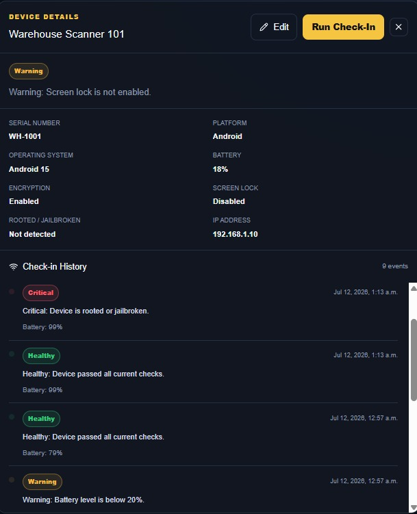

---

# CORS Configuration

The API and frontend are hosted on different domains:

```text
Frontend:
https://fleet-guard-three.vercel.app

Backend:
https://fleetguard-api-sarthak-ckbchjgyh9f8exdr.canadacentral-01.azurewebsites.net
```

The backend uses an ASP.NET Core CORS policy to allow approved frontend origins.

Example application settings:

```text
AllowedOrigins__0 = http://localhost:3000
AllowedOrigins__1 = https://fleet-guard-three.vercel.app
```

The production origin must not contain a trailing slash because browser origins are matched exactly.

---

# Testing

The API has been tested using:

- Postman
- FleetGuard Next.js dashboard
- Browser endpoint testing
- DBeaver
- Entity Framework Core migrations
- Local development environment
- Azure production environment

Test scenarios include:

- Valid device registration
- Missing required values
- Duplicate serial number
- Case-insensitive duplicate serial number
- Retrieve all devices
- Retrieve one device
- Invalid device ID
- Update a device
- Duplicate serial number during update
- Delete a device
- Healthy check-in
- Low-battery warning
- Screen-lock warning
- Encryption failure
- Rooted-device critical state
- Diagnostic-history retrieval
- Cloud data persistence
- Production CORS communication

---

# Deployment

## Backend

The ASP.NET Core API is deployed using:

- Microsoft Azure App Service
- .NET 10 runtime
- Windows App Service
- Free F1 App Service plan
- GitHub Actions CI/CD
- OIDC-managed deployment authentication

## Deployment Workflow

```text
Push to main
      ↓
GitHub Actions starts
      ↓
Set up .NET 10
      ↓
Build backend
      ↓
Publish backend
      ↓
Upload deployment artifact
      ↓
Authenticate with Azure
      ↓
Deploy to Azure App Service
```

## Frontend

The Next.js dashboard is deployed through Vercel.

Vercel is configured with:

```text
Root Directory: fleetguard-ui
Framework: Next.js
```

---

# Postman Testing & Dashboard Screenshots

The following screenshots demonstrate the functionality of the FleetGuard API and dashboard. All endpoints were manually tested using Postman, while the frontend was tested through the Next.js dashboard connected to the ASP.NET Core backend.

---

## Register Device

Registers a new enterprise device.

Expected Response

```text
201 Created
```


---

## Retrieve Device with Invalid ID

Attempts to retrieve a device that does not exist.

Expected Response

```text
404 Not Found
```


---

## Update Device

Updates an existing device's information.

Expected Response

```text
200 OK
```


---

## Healthy Device Check-In

A device with:

- Battery above 20%
- Encryption enabled
- Screen lock enabled
- Not rooted

is automatically classified as **Healthy**.


---

## Low Battery Warning

If the battery level falls below 20%, FleetGuard automatically marks the device with a **Warning** status.


---

## Screen Lock Warning

If screen lock is disabled, the device receives a **Warning** status during the health evaluation.


---

## Rooted / Jailbroken Device

Devices detected as rooted or jailbroken are automatically marked **Critical** because they represent a security risk.


---

## Required Field Validation

ASP.NET Core model validation automatically rejects requests with missing required fields.

Expected Response

```text
400 Bad Request
```


---

## Battery Validation

FleetGuard validates battery values before processing device check-ins.

Invalid battery values are rejected with validation errors.


---

# Dashboard Screenshots

## Dashboard Overview

The dashboard displays enterprise device statistics, inventory, search, filtering, registration, editing, deletion, and health monitoring in real time.

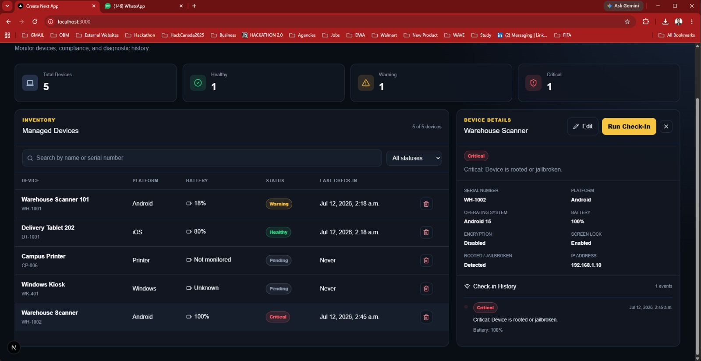

---

## Device Details

Selecting a device opens a detailed panel showing platform information, operating system, battery, encryption, screen lock, root detection, IP address, and current health status.

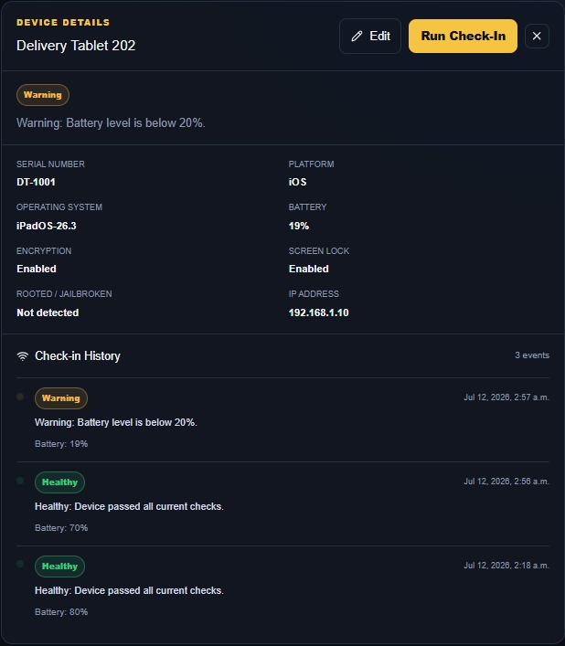

---

## Diagnostic History

Each device check-in generates a diagnostic record. The dashboard visualizes this information as a timeline to help administrators review previous device health events and troubleshoot issues.


# Security Considerations

FleetGuard currently includes:

- HTTPS in production
- CORS restrictions
- Input validation
- Unique serial-number enforcement
- Managed OIDC authentication for Azure deployment
- Environment-based configuration
- No committed production environment secrets

The application does not yet include end-user authentication.

---

# Future API Improvements

## Authentication and Authorization

- JWT authentication
- ASP.NET Core Identity
- Refresh tokens
- Admin and Technician roles
- Role-based endpoint authorization
- Protected dashboard routes
- Microsoft Entra ID integration

## Architecture

- Service layer
- Repository layer
- Interfaces and abstractions
- Global exception-handling middleware
- Standardized API response objects
- Dependency-injected health-evaluation service

## Diagnostics

- Raw log-file ingestion
- Log-level filtering
- Stack-trace parsing
- Crash-report analysis
- Error grouping
- Investigation notes
- Root-cause classification
- Jira-style ticket relationships
- Diagnostic-report export

## Database

- Azure SQL Database
- Explicit relationships and foreign keys
- Cascade-delete rules
- Database backups
- Pagination
- Query optimization
- Audit tables

## Observability

- Serilog
- Azure Application Insights
- Structured logging
- Request correlation IDs
- Performance metrics
- Centralized exception tracking

## Testing

- Unit tests
- Integration tests
- Controller tests
- Health-evaluation tests
- Repository tests
- Automated API tests
- End-to-end dashboard tests

## API Design

- Swagger UI
- Expanded OpenAPI documentation
- API versioning
- Pagination metadata
- Sorting
- Advanced filtering
- Rate limiting
- Problem Details responses

---

# Current API Status

## Completed

- Health endpoint
- Device registration
- Retrieve all devices
- Retrieve device by ID
- Update device
- Delete device
- Device check-in
- Automatic health evaluation
- Diagnostic-history creation
- Diagnostic-history retrieval
- Required-field validation
- Case-insensitive serial normalization
- Duplicate serial-number validation
- Database-level unique index
- Local SQLite persistence
- Azure SQLite persistence
- Next.js dashboard integration
- Production CORS
- Azure App Service deployment
- GitHub Actions CI/CD

## Planned

- JWT authentication
- Role-based authorization
- Raw log analysis
- Crash-report processing
- Azure SQL migration
- Structured logging
- Automated tests
- API versioning

